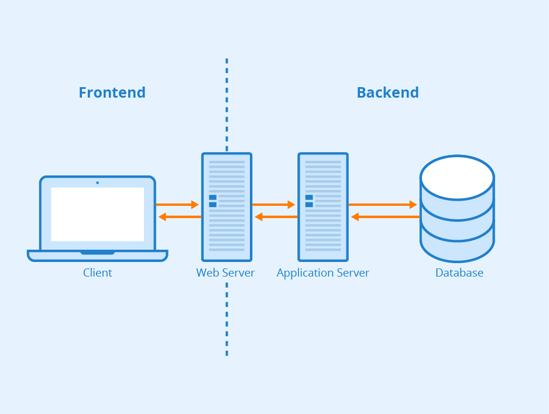

# Trilha Frontend
O objetivo desse repositório é servir de material auxiliar aos estudos de desenvolvimento frontend. Ele é português e fará referência a materiais nesse mesmo idioma, a não ser quando explicitamente dito que está em outra língua.

**Status atual**: Em andamento. Material está incompleto e sendo atualizado constantemente.

## Conhecimento prévio
Conhecimento básico de informática - como instalar software (programas de computador), acessar internet, acessar arquivos e pastas.

## Como utilizar esse material
Você é bem-vinda a utilizar do jeito que desejar. No entanto, existe uma maneira recomendada.

Primeiro, inicie lendo a seção de conhecimentos gerais abaixo. Ao final de cada seção, haverá uma sugestão de próxima lição.

As seções contém material teórico, exemplos, e exercícios para praticar. É importante que se faça os exercícios e continue praticando.

No final da seção, haverá uma lista de links de referência à documentação e outros materiais para saber mais. Alguns desses materiais podem estar em outro idioma que não o português.

## Ferramentas
- **Navegador** (ou *browser*): Google Chrome, Mozilla Firefox. É a principal interface de uma desenvolvedora frontend e também como usuários interagem com páginas web. Existem outras opções também como Opera, Brave, Safari.
- **Editor de texto** (ou *text editor*): Visual Studio Code (outras opções: Notepad++ e Sublime Text). Um simples bloco de notas também pode ser utilizado, mas não oferece as customizações que facilitam o desenvolvimento.

Para saber mais: [Quais são as diferenças entre um editor de código, editor de texto e um IDE?](https://pt.stackoverflow.com/questions/276003/quais-s%C3%A3o-as-diferen%C3%A7as-entre-um-editor-de-c%C3%B3digo-editor-de-texto-e-um-ide)

## Conhecimentos gerais
### O que é desenvolvimento web?
No mundo da tecnologia, existem várias oportunidades. Ao chegar decidir se tornar uma desenvolvedora frontend, foram tomadas algumas decisões. É importante saber o escopo da área de atuação dessa profissão.

Desenvolvimento web se refere à **criação de sites para a internet ou intranet**. Pode ser um site estático, uma aplicação de uma página só (ou _single page application_), um _e-commerce_, um sistema de gerenciamento de conteúdo (_CMS - Content Management System_), redes sociais etc. Os termos e possibilidades podem parecer complicados por agora, então para simplificar, em linhas gerais, **se você interage com um site através de um navegador, ele provavelmente foi desenvolvido por desenvolvedoras web**.

> Para saber mais: [Wikipedia - Web development [ENG]](https://en.wikipedia.org/wiki/Web_development)

### Frontend vs. Backend
Quando se fala de desenvolvimento web, ouvimos os termos frontend e backend. Trata-se de desenvolvimento de partes distintas do sistema.

Ao desenvolver um sistema web, existem duas partes - o servidor e o cliente. No servidor, local de atuação do backend, é onde o sistema armazena dados, processa lógica de negócio e administra autenticação de acessos. No cliente, local de atuação do frontend, o site é disponibilizado pra interagir com o usuário final, o que envolve desenvolver o site pra ser responsivo, rápido, acessível, seguro e ser detectável em sites de busca.

Ambos processos acontecem em computadores, mas em locais distintos. No backend, o servidor está distante, às vezes em outro país do usuário final. No frontend, o aparalho está próximo do usuário - celular, tablet, computador ou TV.

A comunicação entre backend e frontend normalmente é feita através de APIs (_Application Programming Interface_).

Por isso, muitas vezes, a desenvolvedora frontend encontra complexidade devido ao grande número de variáveis a serem administradas - tamanhos de tela, velocidade de internet e poder de processamento distintos dos aparelhos dos seus usários, sem contar o uso de diferentes navegadores.

Fonte: https://www.seobility.net/en/wiki/Frontend

### O que é o navegador?
Sendo uma desenvolvedora frontend, a sua principal ferramenta de trabalho é o navegador. Um navegador é um software que renderiza um site, disponibilizando a interação de um usário com ele. O motor (ou _engine_) de cada navegador difere em codificação, mas eles seguem espeficicações de institutos internacionais. Existem protocolos de comunicação e segurança (o HTTP) e documentação de padronização de linguagem (o ECMA).

É o navegador que interpreta as linguagens de marcação e de programação que 

### Como desenvolvemos um site no frontend?

## Recursos - material adicional
- [Frontend Roadmap [ENG]](https://github.com/Z8264/frontend-developer-roadmap)
https://makefrontendshitagain.party/
https://developer.mozilla.org/pt-BR/docs/Learn/Front-end_web_developer
https://imasters.com.br/desenvolvimento/passado-presente-e-futuro-desenvolvimento-web

**HTML**
- [Documentação HTML - MDN](https://developer.mozilla.org/pt-BR/docs/Web/HTML)

**CSS**
- [Documentação CSS - MDN](https://developer.mozilla.org/pt-BR/docs/Web/CSS)

**Javascript**
- [Documentação Javascript - MDN](https://developer.mozilla.org/pt-BR/docs/Web/JavaScript)

> Sobre as documentações do MDN: se você sabe inglês e português, a documentação do MDN precisa de tradutores a todo momento.